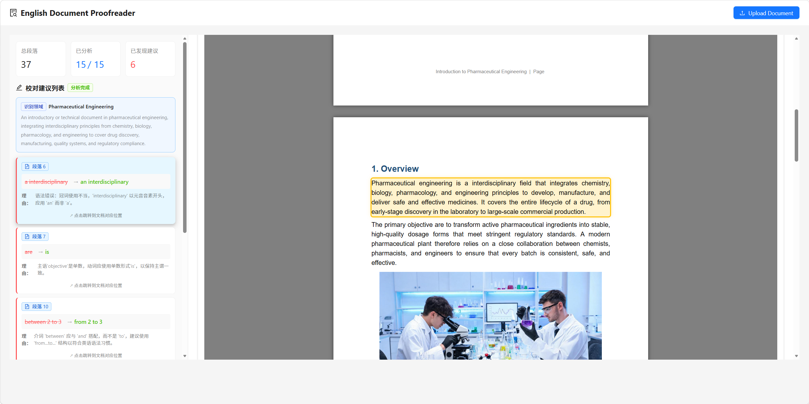
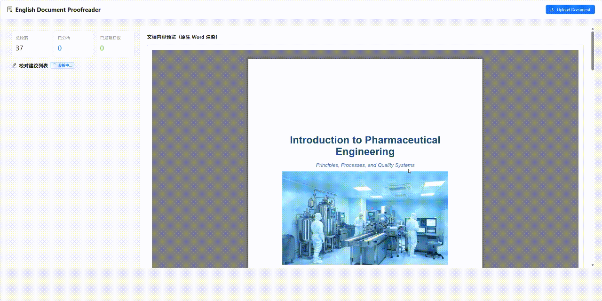
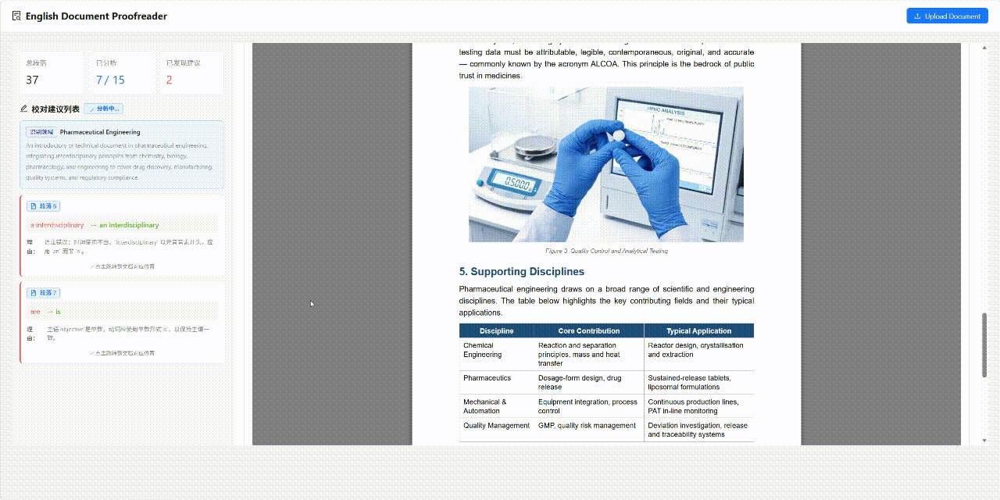

# Document Standardization Intelligent Proofreader

🏆🏆🏆**English** | [简体中文](./README.zh-CN.md)🏆🏆🏆

AI-powered Word document proofreader built with LangChain + LLM — auto-detects the document domain and gives paragraph-level correction suggestions.

After uploading a `.docx` document, the system first identifies the document domain, then checks for spelling, grammar, word choice, and expression issues as a domain expert, and navigates to the corresponding paragraph in the native Word preview on the right for reference.



## Project Structure

```
文件解析修改/
├── backend/                 # Backend service
│   ├── main.py             # FastAPI entry
│   ├── schemas.py          # Data models
│   ├── document_store.py   # Document storage management
│   ├── llm_checker.py      # LLM proofreader
│   ├── requirements.txt    # Python dependencies
│   ├── .env.example        # Example env config
│   └── uploads/            # Uploaded files directory
└── frontend/               # Frontend app
    ├── src/
    │   ├── App.tsx        # Main component
    │   ├── api.ts         # API wrapper
    │   ├── types.ts       # TypeScript types
    │   └── components/    # Components
    ├── package.json       # Node dependencies
    └── vite.config.ts     # Vite config
```

## Getting Started

### 1. Configure Environment

Copy `backend/.env.example` to `backend/.env` and fill in your API key:

```env
# Option 1: OpenRouter (recommended, has free models)
OPENAI_API_KEY=your_openrouter_api_key
OPENAI_BASE_URL=https://openrouter.ai/api/v1
LLM_MODEL=
```

> 🔓 **OpenRouter Free Models**:
> - See https://openrouter.ai/models for more free models

### 2. Start Backend

```bash
cd backend
pip install -r requirements.txt
python main.py
```

Backend runs at `http://localhost:6545`, API docs at `http://localhost:6545/docs`.

> 🌐 **Proxy Note**: If your API service (OpenRouter/OpenAI) requires a proxy, configure it directly in `backend/.env` and it will be loaded automatically on startup:
>
> ```env
> HTTP_PROXY=http://127.0.0.1:7890
> HTTPS_PROXY=http://127.0.0.1:7890
> ```
>
> Replace `7890` with your actual proxy port. Leave empty for no proxy (direct connect). If LLM connection fails, analysis will explicitly return an "LLM call failed" error instead of silently degrading.

### 3. Start Frontend

```bash
cd frontend
npm install
npm run dev
```

Frontend runs at `http://localhost:3000` (Vite will auto-switch to 3001/3002 if occupied).

## Features

### 1. Document Upload & Analysis
- Supports .docx Word documents
- Auto-extracts document paragraphs
- Auto-detects document domain
- Real-time analysis progress (analyzed / total paragraphs)

### 2. Proofreading Suggestions
- Streamed suggestion list on the left
- Shows original word, suggested correction, and Chinese reason
- Clicking a suggestion card navigates to and highlights the corresponding paragraph in the native Word preview (reference only)

### 3. Native Document Preview
- Word document rendered with docx-preview on the right

## Usage Flow

1. **Upload Document**: Click "Upload Document" button and select a .docx file
2. **View Suggestions**: System automatically analyzes and lists proofreading suggestions on the left
3. **Locate Original**: Click any suggestion card, document preview will scroll to and highlight that paragraph (reference only)





## LLM Proofreading

Proofreading happens in two steps:

1. **Domain Detection**: Automatically determines document domain based on document content (e.g., pharmaceutical engineering, chemical engineering, crystallization process, etc.).
2. **Paragraph-level Proofreading**: As a domain expert, checks paragraph by paragraph for spelling, grammar, word choice, and expression issues, with Chinese explanations.

## Development

### Adjust LLM Prompts

Modify `domain_prompt` (domain detection) or `proofread_prompt` (paragraph proofreading) in `backend/llm_checker.py`.

## FAQ

**Q: Does it support other document formats besides .docx?**
A: Currently only .docx is supported. .doc files need to be converted first.

**Q: How do I change the LLM model?**
A: Modify `OPENAI_BASE_URL` and `LLM_MODEL` in the `.env` file.

**Q: Why does analysis show "LLM call failed"?**
A: Usually because the backend cannot connect to the LLM service. Check your API key and network proxy configuration as described above.
